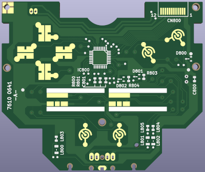
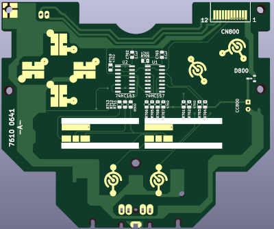

# PC-Engine-GT-Controller
This repository contains a recreation and a remaster of the
controller board PCB for PC Engine GT Handheld.

#### Original Controller PCB

The original recreation is based on the reverse engineering of the original
PCB and schematics using scanned images of the original
board's copper layers, so should be a reasonably accurate reproduction.

#### Remaster Controller PCB

The remaster is based on the schematics of the pc engine controller which
uses logic chips to control the user input into the GT Handheld.
Some functionality is lost using this board, such as using the Link Cable.

## PCB Production

Minimum track widths, clearances and via sizes are within the standard
offering of modern PCB fabricators. Development was done using JLCPCB and as
such the Gerber files are provided to their specification.

The design is verified to work as a 2-layer PCB.

## Bill of Materials

Most parts are marked on the board and it is expected that these will be reused
from a donor board. It is completely possible that your particular board uses
different (but compatible) parts so it's advisable to take photos before starting.

[**Interactive BOM Original**][IBOM-Original]

[**Interactive BOM Remaster**][IBOM-Remaster]

## Thanks

  * Rob Taylor ([@PeepoUK](https://github.com/PeepoUK)) for doing most of
    the PCB layout.\
&nbsp;
  * Simon "Aergan" Lock ([@Aergan](https://github.com/Aergan)),\
    Cosam (@cosam_the_great),\
    Dennis (@PointerFunction),\
    Leo Oliveria (@leo__oliveira),\
    Zaxour 阿宅, (@zaxour),\
    Ian Cudlip (@grandoldian)\
    for their insights, support and testing of the prototype boards.\
&nbsp;
  * The rest of the Board Folk Team for their support and general
    coolness.\
&nbsp;

## Legal

As the product of this project is a replica of a proprietary product, the
the author makes no claim of copyright to the schematics nor PCB layouts and
releases these into the public domain, solely for the purposes of study and
historical preservation.

You are free to produce PCBs based on this project's designs at your own risk
and without limitation, for your own use or for sale and/or repair at a
reasonable price. Attribution is appreciated. The authors are not obliged to
provide support of any kind.

Under no circumstances will the authors be held responsible or liable in any
way for losses, damages or costs resulting from the use of the information
and/or resources of this project.

The resources are provided "as-is" without warranty of any kind, either
expressed or implied, including, but not limited to, the implied warranties
of merchantability and fitness for a particular purpose.

[IBOM-Original]: http://htmlpreview.github.io/?https://raw.githubusercontent.com/Board-Folk/PC-Engine-GT-Controller/main/original-7610-0641-A/bom/PC%20Engine%20GT%20Controller%20PCB.html

[IBOM-Remaster]: http://htmlpreview.github.io/?https://raw.githubusercontent.com/Board-Folk/PC-Engine-GT-Controller/main/remaster/bom/PC%20Engine%20GT%20Controller%20BOM.html
